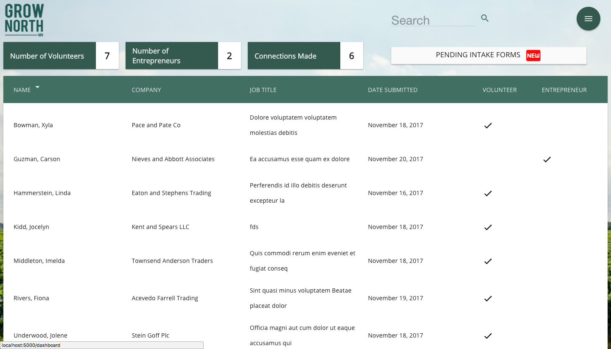
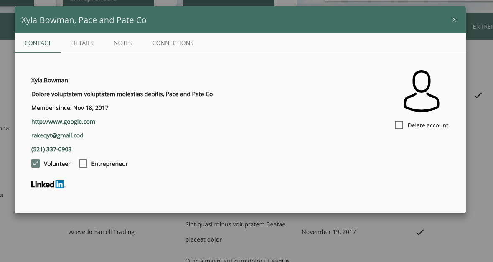

# Grow-North-MN

Full stack web application built for Grow North MN. This app facilitates connection building between food and agriculture businesses. Admin and guest are the users. Guests can access the survey form to enter their information about their business, which adds this data to a database that can be acccessed by the admin side. The admin can create an account, change password, and log in. Once logged in, admin can view the directory of all persons in the database, read their information, update any line, and delete the person's profile. Admin can also create connections between profiles and add comments about profile or connection.

    -- LINK TO HEROKU APP --

## Built With

JavaScript, AngularJS, Node.js, Express.js, PostgreSql, Angular Material, HTML5, CSS, Material Design icons, Passport, Md Pagination.

## Getting Started

These instructions will get you a copy of the project up and running on your local machine for development and testing purposes. See deployment for notes on how to deploy the project on a live system.

### Prerequisites

Link to software that is required to install the app (e.g. node).
- [Node.js](https://nodejs.org/en/)
- [Postico] (https://eggerapps.at/postico/)

### Installing

NPM install.
Copy and paste entry in database.sql file in home directory to create necessary tables in Postico.

 +Steps to get the development environment running.

## Screen Shots

Dashboard screenshot:

 

 

Profile view screenshot:
 

 

## Documentation

### Completed Features

- Admin log in.
- Password reset.
- Survey form.
- Directory view.
- Search directory by single word or single tag.
- View and approve new entries.
- Profile view for each entry in directory.
- Edit single entries in profile view.
- Add comments to profile.
- Add connections between entries in directory.
- Add comments for each connection.

### Next Steps

- Pagination with search ability for directory.
- Edit list items in profile (involvement, how do they want to help, ecosystem).
- Ability for admin to edit survey form questions.

## Deployment

## Authors
Katie Campbell, Nestor Gomez-Jimenez, Evan Kearney, Mike Pettman, Cam Schnackel, Greg Wallerus.

## Acknowledgments

-Scott Bromander and Kris Szafranski for base passport code.